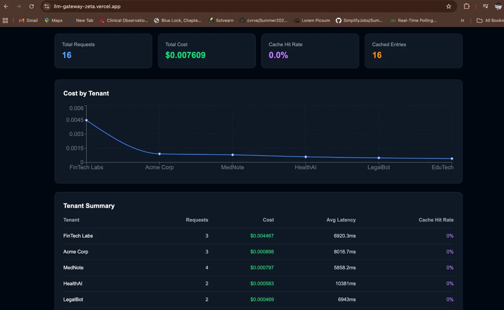
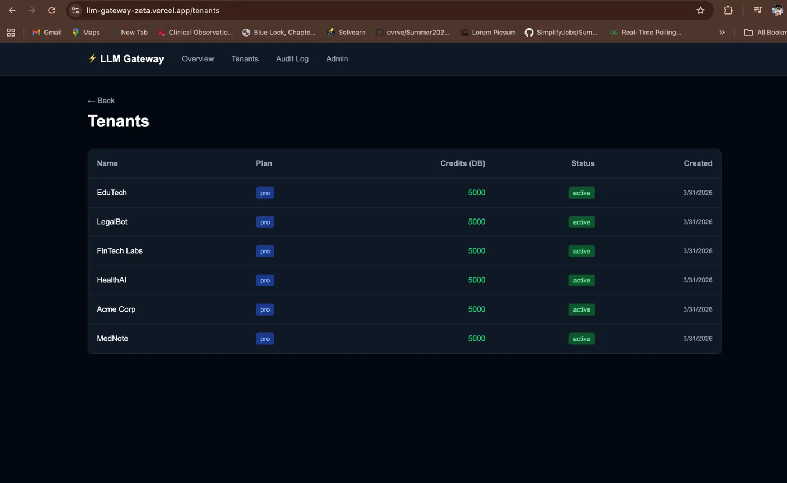
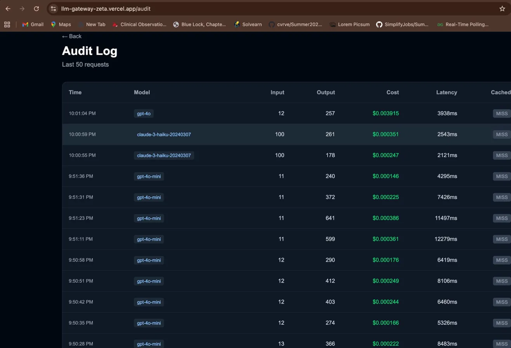
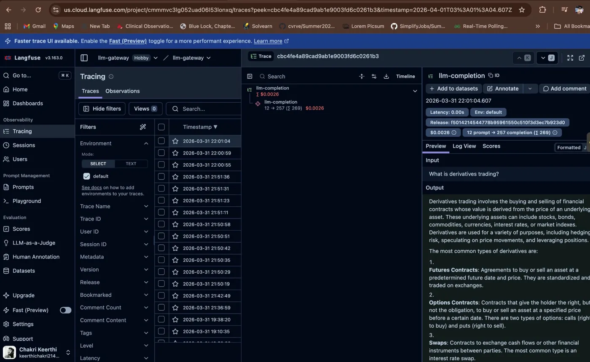
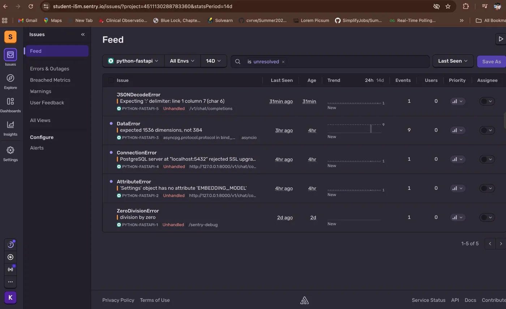
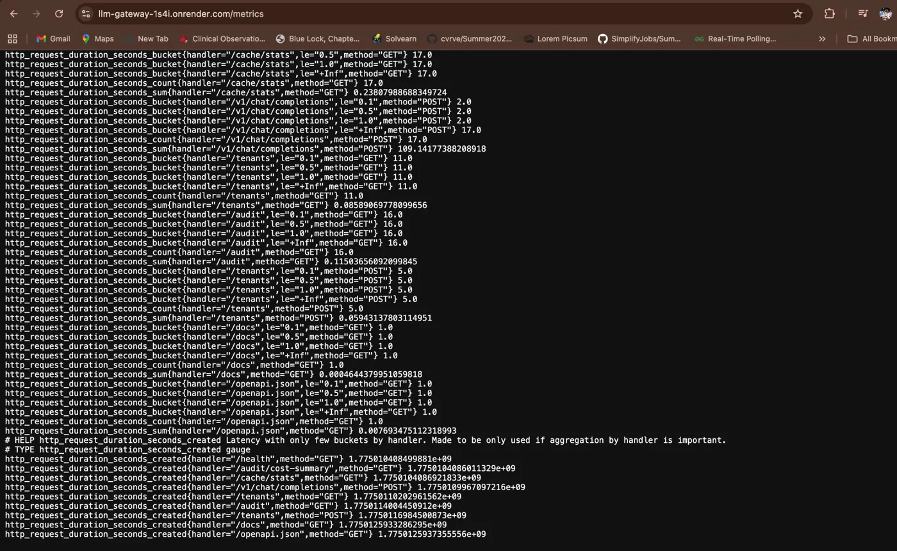
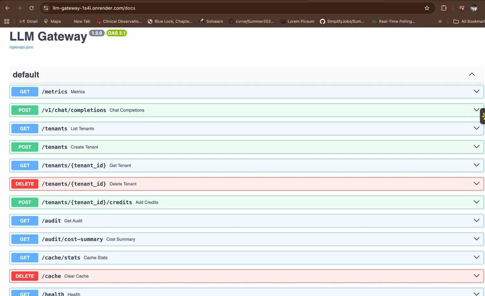
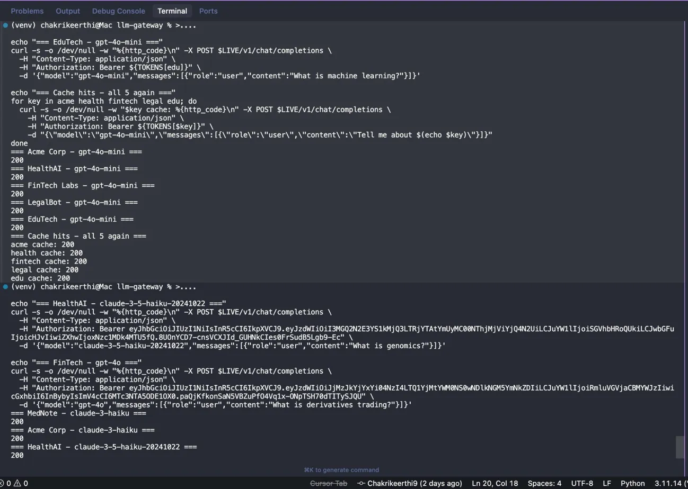

# ⚡ LLM Gateway

> Production-grade multi-tenant LLM proxy with semantic caching, budget enforcement, injection detection, and full observability.

[](https://llm-gateway-1s4i.onrender.com/health)
[](https://llm-gateway-zeta.vercel.app)
[](https://python.org)
[](https://fastapi.tiangolo.com)
[](https://www.linkedin.com/in/chakri-keerthi16/)

---

## What is this?

LLM Gateway is a production-ready API proxy that sits between your application and LLM providers (OpenAI, Anthropic). It solves three problems every team building with LLMs faces:

- **Cost control** — per-tenant credit enforcement with atomic Redis operations. No race conditions.
- **Duplicate spend** — semantic caching with pgvector. Similar questions return cached answers at $0.
- **Prompt injection** — embedding similarity detection blocks attacks that regex never catches.

**Live URLs:**
- API: https://llm-gateway-1s4i.onrender.com
- Dashboard: https://llm-gateway-zeta.vercel.app
- Docs: https://llm-gateway-1s4i.onrender.com/docs

---

## System Architecture



---

## Dashboard







---

## Observability







---

## API & Testing





---

## Middleware Stack

```
Client Request
     │
     ▼
┌─────────────────────────────────────────┐
│           FastAPI Middleware Stack       │
│                                         │
│  L1  JWT Auth        HS256 · <1ms       │
│  L2  Budget + Rate   Redis DECR · 60/m  │
│  L3  Injection       Cosine · 0.60      │
│  L4  Semantic Cache  pgvector · 0.95    │
│  L5  LiteLLM Router  SSE stream         │
│                                         │
│  Background: Reconciliation             │
└─────────────────────────────────────────┘
     │                    │
     ▼                    ▼
LLM Providers         Observability
OpenAI · Anthropic    LangFuse · Sentry · Prometheus
```

### Why this middleware order matters

Each layer acts as a gate. A request only reaches the next layer if it passes the current one:

- L1 rejects unauthenticated requests before any DB query
- L2 rejects over-budget/rate-limited requests before embedding computation
- L3 blocks injections before cache lookup — prevents poisoned cache entries
- L4 returns cached responses before any LLM call
- L5 only fires for authenticated, budgeted, clean, cache-miss requests

---

## 5-Layer Middleware

### L1 — JWT Authentication
Every request must carry a signed JWT token. The middleware decodes it with HS256, extracts `tenant_id`, and rejects anything invalid in under 1ms. No database query at this layer.

```python
payload = jwt.decode(token, settings.JWT_SECRET, algorithms=["HS256"])
request.state.tenant_id = payload["sub"]
```

### L2 — Budget Enforcement + Rate Limiting
Credits are tracked in Redis using atomic `DECR`. This makes overspending physically impossible — there is no window between "check credits" and "deduct credits" where a race condition can occur. Rate limiting uses a Redis sliding window: 60 requests per tenant per minute.

```python
remaining = await r.decr(f"tenant:{tenant_id}:credits")
if remaining < 0:
    return JSONResponse(status_code=429, content={"error": "Insufficient credits"})
```

**Why Redis not PostgreSQL?** PostgreSQL requires SELECT + UPDATE with locking. Redis DECR is a single atomic operation — no locks, no race conditions, ~0.1ms.

### L3 — Prompt Injection Detection
User input is embedded using OpenAI `text-embedding-3-small` (production) or `all-MiniLM-L6-v2` (local). The embedding is compared against 10 known injection templates via cosine similarity. Queries above 0.60 similarity are blocked.

```python
similarity = cosine_similarity(query_embedding, template_embedding)
if similarity > 0.60:
    return JSONResponse(status_code=400, content={"error": "Injection blocked"})
```

**Why embedding similarity and not regex?** Regex catches exact patterns. Embeddings catch semantic meaning — paraphrased attacks like "disregard all prior instructions" score 0.654 similarity against "ignore previous instructions."

### L4 — Semantic Cache
Query embeddings are stored in PostgreSQL with pgvector. Incoming queries are compared against cached embeddings using cosine similarity. Matches above 0.95 return cached responses instantly at zero API cost.

```sql
SELECT response_text, 1 - (query_embedding <=> $1::vector) AS similarity
FROM semantic_cache
WHERE tenant_id = $2
  AND 1 - (query_embedding <=> $1::vector) >= 0.95
ORDER BY similarity DESC LIMIT 1
```

**Why per-tenant cache?** `WHERE tenant_id = $2` prevents cross-tenant data leakage. A healthcare tenant's cached responses never appear in a fintech tenant's results.

### L5 — LiteLLM Router
LiteLLM provides a unified interface to OpenAI, Anthropic, and other providers. Responses stream via Server-Sent Events so the client receives tokens as they generate.

```python
response = await litellm.acompletion(model=model, messages=messages, stream=True)
async for chunk in response:
    yield f"data: {json.dumps({'choices': [{'delta': {'content': token}}]})}\n\n"
```

**Background reconciliation** runs after the stream — logging to audit_log, storing the response embedding in cache, adjusting Redis credits. The client never waits for this.

---

## Tech Stack

| Layer | Technology | Why |
|-------|-----------|-----|
| API | FastAPI 0.135 | Async-native, automatic OpenAPI docs |
| LLM routing | LiteLLM | Single interface for OpenAI + Anthropic |
| Vector DB | PostgreSQL + pgvector | SQL queries + vector search in one DB |
| Cache | Redis 7 | Atomic DECR, sub-ms latency |
| Embeddings (prod) | OpenAI text-embedding-3-small | 1536-dim, no RAM overhead on server |
| Embeddings (local) | sentence-transformers all-MiniLM-L6-v2 | 384-dim, free, fast locally |
| Auth | python-jose HS256 | Lightweight, stateless JWT |
| Tracing | LangFuse | Per-call cost + latency per tenant |
| Errors | Sentry | Full stack traces in production |
| Metrics | Prometheus + prometheus-fastapi-instrumentator | Request counts, latency histograms |
| Dashboard | Next.js 16 + Recharts | Real-time observability UI |
| DB driver | asyncpg | Async PostgreSQL, connection pooling |
| Deployment | Render (API) + Vercel (dashboard) | Free tier, auto-deploy on push |

---

## API Reference

| Method | Endpoint | Auth | Description |
|--------|----------|------|-------------|
| POST | `/v1/chat/completions` | JWT | Main gateway — streams LLM response |
| GET | `/health` | None | Postgres + Redis status |
| GET | `/metrics` | None | Prometheus metrics |
| GET | `/docs` | None | Swagger UI |
| POST | `/tenants` | X-Admin-Key | Create tenant |
| GET | `/tenants` | X-Admin-Key | List all tenants |
| POST | `/tenants/{id}/credits` | X-Admin-Key | Add/remove credits |
| GET | `/audit` | X-Admin-Key | Last 50 requests |
| GET | `/audit/cost-summary` | X-Admin-Key | Cost by tenant |
| GET | `/cache/stats` | X-Admin-Key | Cache entries count |
| DELETE | `/cache` | X-Admin-Key | Clear all cache |

### Quick Start

```bash
# Call exactly like OpenAI
curl -X POST https://llm-gateway-1s4i.onrender.com/v1/chat/completions \
  -H "Content-Type: application/json" \
  -H "Authorization: Bearer $TOKEN" \
  -d '{"model": "gpt-4o-mini", "messages": [{"role": "user", "content": "What is DNA?"}]}'

# Works with Anthropic too
curl -X POST https://llm-gateway-1s4i.onrender.com/v1/chat/completions \
  -H "Content-Type: application/json" \
  -H "Authorization: Bearer $TOKEN" \
  -d '{"model": "claude-3-haiku-20240307", "messages": [{"role": "user", "content": "What is DNA?"}]}'
```

---

## Local Setup

```bash
# 1. Clone
git clone https://github.com/Chakrikeerthi9/llm-gateway
cd llm-gateway

# 2. Start Docker (Mac with Colima)
colima start --cpu 2 --memory 4 --dns 8.8.8.8
docker compose up -d

# 3. Virtual environment
python -m venv venv && source venv/bin/activate
pip install -r requirements.txt

# 4. Environment variables
cp .env.example .env
# Fill in: OPENAI_API_KEY, JWT_SECRET, DATABASE_URL, REDIS_URL, ADMIN_API_KEY

# 5. Run schema
docker exec -i llm-gateway-postgres-1 psql \
  -U gateway_user -d gateway < migrations/001_init.sql

# 6. Start server
uvicorn app.main:app --reload --port 8000

# 7. Create a tenant
curl -X POST http://localhost:8000/tenants \
  -H "Content-Type: application/json" \
  -H "X-Admin-Key: your-admin-key" \
  -d '{"name": "MyCompany", "plan": "pro", "credits": 1000}'

# 8. Generate a JWT
python scripts/generate_token.py

# 9. Start dashboard
cd dashboard && npm install && npm run dev
```

---

## Real Tested Performance

All values measured on live production deployment (Render free tier, Oregon):

| Metric | Value | Notes |
|--------|-------|-------|
| Cache hit latency | ~50ms | pgvector cosine search |
| Middleware overhead | ~19ms p99 | L1–L4 combined |
| LLM latency warm | ~2000ms | After cold start |
| Load test (10 users, 30s) | 0 failures | 4.65 req/sec sustained |
| Injection detection | 0.654 similarity | Blocked at 0.60 threshold |
| Total cost (17 requests) | $0.007609 | gpt-4o-mini + claude-3-haiku |
| Cheapest request | $0.000144 | gpt-4o-mini, 11 input tokens |
| Most expensive request | $0.003915 | gpt-4o, 12 input / 257 output |

---

## Trade-offs

### Latency
**Decision:** Async reconciliation — log after stream, not before response.

Client receives streamed response immediately. Audit logging, cache storage, and credit adjustment happen in a background task. Adds ~0ms to felt latency but audit log lags ~100ms after the response.

**Trade-off:** Faster UX vs. slightly delayed observability data.

### Scalability
**Decision:** Stateless FastAPI + external Redis/PostgreSQL.

The gateway holds no state. All state lives in Redis (credits, rate limits) and PostgreSQL (tenants, cache, audit). Horizontal scaling works — add more instances behind a load balancer without any code changes.

**Current limit:** Free tier handles ~20 concurrent users. 1000 concurrent needs horizontal scaling + load balancer.

### Security
**Decision:** Per-tenant cache namespace + parameterized SQL.

`WHERE tenant_id = $1` on every query prevents cross-tenant data leakage at the SQL level. Parameterized queries make SQL injection impossible.

**Known gap:** No JWT revocation. Stolen token is valid until 24hr expiry. Fix: token blacklist in Redis.

### Observability
**Decision:** Three tools — LangFuse (LLM traces), Sentry (errors), Prometheus (infrastructure).

Each tool does one thing well. Combined they give complete visibility from individual LLM call cost to infrastructure-level request rates.

**Known gap:** Cache hits not logged to audit_log. Dashboard shows 0% cache hit rate even when cache is working. Fix: log cache hits directly in cache middleware.

### Cost
**Decision:** OpenAI embeddings in production, local model in development.

`all-MiniLM-L6-v2` (384-dim, free) locally. `text-embedding-3-small` (1536-dim, ~$0.00002/request) in production. Cost is negligible but eliminates the 400MB+ RAM requirement that breaks Render's free tier.

---

## Future Enhancements

- JWT revocation via Redis blacklist
- Webhook alerts when tenant credits fall below threshold
- Embedding result cache to avoid recomputing for identical inputs
- Provider failover — if OpenAI fails, route to Anthropic automatically
- Tenant self-serve signup flow
- Grafana dashboard connected to Prometheus
- tiktoken for accurate token counting
- Input length limits per tenant plan

---

## Built By

**Chakri Keerthi** — Full Stack AI Engineer

[](https://www.linkedin.com/in/chakri-keerthi16/)
[](https://github.com/Chakrikeerthi9)
